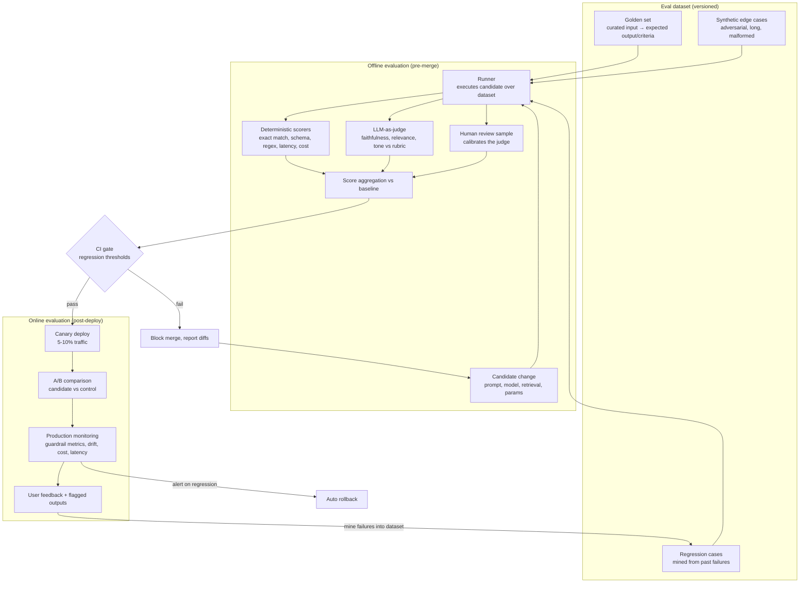

# Design Pattern: AI Evaluation Pipeline

> **Pattern family:** `ai-observability/` + `prompt-pipelines/`
> **Status:** Stable - the difference between a demo and a product
> **Last reviewed:** June 2026

---

## 1. Problem

LLM systems are non-deterministic, and their inputs are open-ended. That breaks the assumptions normal software testing relies on:

1. **You cannot unit-test a prompt.** The same input can produce different outputs; "correct" is often a judgement, not an equality check.
2. **Changes have invisible blast radius.** A prompt tweak that fixes one case silently breaks twelve others. Without measurement, every change is a gamble.
3. **Vibes-based iteration does not scale.** "It looks better to me" works for a demo with one developer. It collapses the moment there are two prompts, two models, or two engineers.
4. **Production drifts.** Real user inputs shift over time; the model provider updates the model under you; quality decays with no code change at all.

An evaluation pipeline turns model quality into a **measured, gated, monitored** property - the same discipline CI/CD brought to correctness.

---

## 2. Architecture

**The three layers, and what each is for:**

| Layer | Catches | Cadence | Cost |
|---|---|---|---|
| Deterministic scorers | Format breaks, schema violations, missing citations, latency/cost regressions | Every run, every case | Negligible |
| LLM-as-judge | Faithfulness to sources, relevance, tone, instruction-following | Every run, every case | Real but acceptable (use a cheap-strong judge model) |
| Human review | Judge calibration, novel failure modes, taste | Sampled (5-10%), and on every judge rubric change | Expensive - spend it where machines are blind |

**The flywheel is the point.** Production failures get mined back into the regression set, so the dataset grows to cover exactly the failures your system actually has. A static golden set decays; a fed one compounds.

---

## 3. When to use it

**Use a full pipeline when:**
- The LLM feature is **user-facing or business-critical** - wrong answers carry cost.
- **More than one person** changes prompts, models, or retrieval config.
- You plan to **swap or upgrade models** - an eval suite is the only way to compare candidates on your task rather than on public benchmarks.
- Output quality has **multiple dimensions** (correct AND grounded AND on-tone AND under cost budget) that trade off against each other.

**A lighter version is fine when:**
- Prototyping. A 20-case golden set run manually beats nothing and takes an afternoon. Build the dataset before the dashboard.
- The task has deterministic ground truth (classification, extraction with known answers). Standard test metrics (accuracy, F1) suffice; skip the judge.

**The anti-pattern** is the inverse: shipping prompt changes to production with zero measurement because "we'll watch the feedback". User feedback is sparse, biased toward extremes, and arrives after the damage.

---

## 4. Trade-offs

| Decision | Option A | Option B | The real trade |
|---|---|---|---|
| Judge type | LLM-as-judge: cheap, fast, scalable | Human labels: ground truth | The judge is biased (verbosity, position, self-preference) but evaluates 1,000 cases for the price of a human evaluating 20. Use the judge for breadth, humans to calibrate the judge. |
| Dataset size | Small (50-100): fast CI, noisy signal | Large (1,000+): reliable, slow, costly | Small sets cannot detect small regressions; statistical noise swamps a 3% quality drop. Size the set to the effect size you need to detect, run a fast smoke subset on every commit and the full set nightly. |
| Gate strictness | Hard thresholds: no regression ships | Soft review: humans decide on yellow | Hard gates on noisy metrics block good changes; soft gates erode into rubber stamps. Hard-gate deterministic metrics, soft-gate judged ones with required sign-off. |
| Metric scope | Single overall score: simple to gate | Per-dimension scores: diagnostic | One blended number hides a faithfulness drop offset by a tone gain. Gate per-dimension, report blended. |
| Online eval | Ship after offline pass | Canary + A/B always | Offline sets never fully match production distribution. The discipline of canarying costs infra work once and pays on every release. |

---

## 5. Failure points

1. **Judge drift and bias.** The judge model updates, or systematically prefers longer answers, and your scores shift with no real quality change. *Mitigation:* pin judge model versions, calibrate against a human-labelled anchor set, re-validate the rubric whenever the judge changes, randomise position in pairwise comparisons.

2. **Dataset staleness.** The golden set reflects last year's users. The system scores 95% offline and disappoints in production. *Mitigation:* the failure-mining flywheel, plus periodic sampling of fresh production traffic into the set (with consent and PII handling resolved).

3. **Overfitting to the eval.** Engineers iterate against the same 100 cases until the prompt is tuned to the test, not the task. Goodhart's law, LLM edition. *Mitigation:* a held-out set that is never used during iteration, only at gate time; rotate it periodically.

4. **Contamination.** Eval cases leak into few-shot examples or fine-tuning data, inflating scores. *Mitigation:* dataset versioning with provenance, and an explicit check that eval inputs never appear in prompt templates or training corpora.

5. **Gating on averages, shipping tail failures.** Mean score improves while the worst 5% of outputs get worse - and the tail is what users screenshot. *Mitigation:* track p95-worst-case scores and category-level breakdowns, not just the mean.

6. **Eval-prod mismatch.** Offline eval runs the prompt in isolation; production runs it inside a pipeline with retrieval, history, and tools. The thing you measured is not the thing you shipped. *Mitigation:* evaluate end-to-end through the production code path, not the prompt in a vacuum.

7. **No ownership.** The pipeline exists, the dashboard exists, nobody is on the hook when the score drops. *Mitigation:* regression alerts route to a named owner with rollback authority; eval failures block release like test failures do.

---

## 6. Related patterns

- **RAG System Architecture** - retrieval quality (recall, precision) needs its own eval layer upstream of answer quality.
- **Multi-Agent Workflow Architecture** - evaluate end-to-end task success, then per-agent metrics for diagnosis.
- **AI Observability** (`ai-observability/`) - production monitoring is the online half of this pattern; tracing supplies the failure cases the dataset feeds on.
