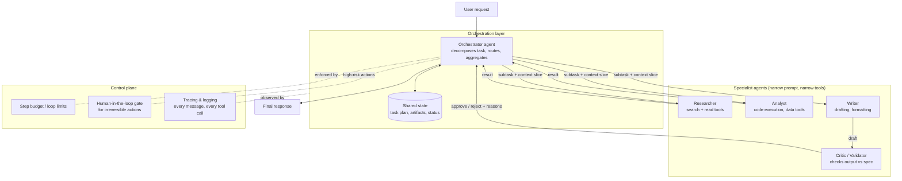

# Design Pattern: Multi-Agent Workflow Architecture

> **Pattern family:** `agent-systems/`
> **Status:** Maturing - use with restraint
> **Last reviewed:** June 2026

---

## 1. Problem

A single LLM agent given a complex, multi-step task degrades in predictable ways:

1. **Context overload.** One agent juggling research, planning, execution, and review accumulates a long, noisy context. Performance drops as the context fills with intermediate clutter.
2. **Role interference.** A prompt that says "be a rigorous critic AND a fast executor" gets a model that is mediocre at both. Conflicting instructions in one prompt dilute each other.
3. **No isolation of failure.** When one monolithic agent goes wrong on step 7 of 12, you cannot retry step 7. You retry everything, or you ship the error.
4. **Unbounded autonomy.** Long single-agent loops drift from the goal with no checkpoint where a human or a validator can intervene.

Multi-agent architecture decomposes the task into specialist agents with narrow prompts, narrow tools, and explicit handoffs - the same reason large functions get split into small ones.

---

## 2. Architecture

The dominant production pattern is **orchestrator-worker** (also called supervisor pattern):

**Key structural rules:**

- **The orchestrator plans and routes; it does not do the work.** Mixing planning and execution in one agent recreates the monolith problem.
- **Workers receive a context slice, not the full history.** Each specialist sees only what its subtask needs. This is the main mechanism by which multi-agent systems beat single agents - context isolation, not "more intelligence".
- **State lives outside the agents.** A shared, inspectable store (task list, artifacts, statuses) survives agent failures and makes the system debuggable. Agents communicate through state and structured handoffs, not free-form chat.
- **Every loop has a budget.** Maximum steps, maximum cost, maximum wall-clock time. An agent system without hard limits is an incident waiting for a trigger.
- **Irreversible actions go through a gate.** Sending the email, executing the trade, deleting the records - human approval or strict validation before the side effect, not after.

**Alternative topologies** worth knowing, in increasing order of risk: **pipeline** (fixed sequence of agents, no dynamic routing - most "multi-agent" problems are actually this), **orchestrator-worker** (above), and **peer network** (agents messaging each other freely - hard to control, rarely justified in production).

---

## 3. When to use it

**Use multi-agent when:**
- The task has **genuinely distinct phases** needing different tools or instructions (research → analysis → drafting → review).
- A single agent's context would be **dominated by intermediate noise** the final step does not need.
- You need an **adversarial check** - a critic agent reviewing a producer agent catches errors the producer cannot see in its own output.
- Subtasks are **parallelisable** (research five competitors simultaneously, then aggregate).

**Do not use multi-agent when:**
- A single agent with good tools and a clear prompt does the job. This covers most cases. Multi-agent multiplies cost, latency, and failure surface - it must buy you something concrete.
- The workflow is **fixed and deterministic**. Use a pipeline with LLM calls at each step. Dynamic routing you do not need is complexity you pay for anyway.
- You cannot yet evaluate the single-agent version. If you cannot measure one agent, you cannot debug five.

The senior-engineer heuristic: **start with one agent, add a second only when you can name the specific failure the second one fixes.**

---

## 4. Trade-offs

| Decision | Option A | Option B | The real trade |
|---|---|---|---|
| Topology | Pipeline: predictable, testable | Orchestrator: handles open-ended tasks | Dynamic routing is power you pay for in debuggability. Choose the dumbest topology that handles your task distribution. |
| Context sharing | Full history to every agent | Minimal slices per agent | Full history reintroduces context overload; minimal slices risk an agent missing a constraint. Err minimal, pass constraints explicitly. |
| Model mix | Same strong model everywhere | Strong orchestrator, cheaper workers | Routing simple subtasks to smaller models cuts cost 3-10x, but a weak worker's errors flow downstream. Match model to subtask difficulty, verify at the boundary. |
| Autonomy | Long leash: fewer interruptions | Tight gates: human checks | Every gate adds friction; every removed gate adds blast radius. Gate on irreversibility, not on frequency. |
| Communication | Structured schemas between agents | Natural-language handoffs | Schemas catch malformed handoffs early; prose handoffs degrade silently. Use structured outputs at every boundary. |

---

## 5. Failure points

1. **Error cascade.** Agent 1 makes a small factual error; agents 2-4 build on it; the final output is confidently wrong with no single step that looks broken. *Mitigation:* validation at boundaries, a critic agent with grounding tools, and source citation requirements that survive handoffs.

2. **Ping-pong loops.** Producer and critic disagree forever; orchestrator keeps re-delegating. Cost burns with no progress. *Mitigation:* hard step budgets, loop detection on repeated state, and an escalation path (return to user with the disagreement, not an infinite retry).

3. **State divergence.** Two agents read state, work in parallel, and write conflicting updates. The shared plan no longer reflects reality. *Mitigation:* single-writer ownership per state field, or optimistic locking with explicit merge handling.

4. **Lost constraints at handoff.** The user said "budget under £5k" to the orchestrator; the writer agent never sees it. The most common multi-agent bug in practice. *Mitigation:* a constraints object propagated verbatim into every worker's context, checked by the validator.

5. **Cost and latency multiplication.** Five agents with retries can mean 20-50 LLM calls per request. A response that took one agent 8 seconds takes the system 90. *Mitigation:* parallelise independent subtasks, cache repeated lookups, and continuously question whether each agent earns its keep.

6. **Untraceable failures.** Without full tracing of every inter-agent message and tool call, "the answer was wrong" is undebuggable. *Mitigation:* treat tracing as a launch requirement, not an add-on - log every message, tool call, and state mutation with a request-level trace ID (see `ai-observability/`).

7. **Authority confusion.** A worker agent treats retrieved or user-supplied content as instructions and goes off-task; the orchestrator dutifully aggregates the hijacked result. *Mitigation:* strict separation of instruction channel and data channel in every prompt, and tool permissions scoped per agent (the researcher cannot send emails).

---

## 6. Related patterns

- **RAG System Architecture** - frequently a tool inside the researcher agent rather than a separate system.
- **AI Evaluation Pipeline** - multi-agent systems need end-to-end task evals, not just per-agent unit evals.
- **AI Observability** (`ai-observability/`) - tracing is what makes this pattern operable.
