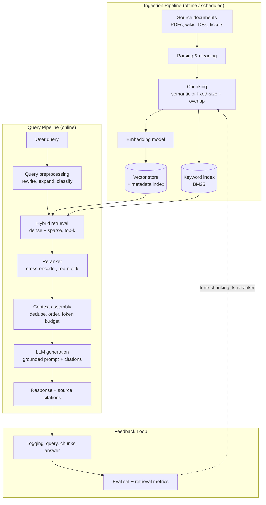

# Design Pattern: RAG System Architecture

> **Pattern family:** `rag-systems/`
> **Status:** Stable, production-proven
> **Last reviewed:** June 2026

---

## 1. Problem

LLMs have three structural weaknesses that no amount of prompting fixes:

1. **Knowledge is frozen at training time.** The model cannot know about your internal documents, yesterday's policy change, or this morning's ticket.
2. **Fine-tuning is the wrong tool for knowledge injection.** It is expensive, slow to update, and models still hallucinate fine-tuned facts. Fine-tuning changes *behaviour*, not *knowledge recall*.
3. **Hallucination is unbounded without grounding.** A model asked about a contract it has never seen will produce a fluent, confident, wrong answer.

Retrieval-Augmented Generation (RAG) solves this by separating **knowledge storage** (a searchable index you control and update) from **reasoning** (the LLM), and joining them at query time.

---

## 2. Architecture

**Component responsibilities:**

| Component | Job | Typical choices |
|---|---|---|
| Chunker | Split documents into retrievable units | 256–1024 tokens, 10–20% overlap, respect structural boundaries (headings, clauses) |
| Embedding model | Map text to vectors | OpenAI text-embedding-3, Cohere embed, open-source bge/gte |
| Vector store | ANN search over embeddings + metadata filters | pgvector, Pinecone, Qdrant, Weaviate |
| Sparse index | Exact keyword / acronym matching | BM25 (Elasticsearch, OpenSearch, or built into the vector DB) |
| Reranker | Re-score top-k candidates with a cross-encoder | Cohere Rerank, bge-reranker; cuts noise dramatically |
| Context assembler | Fit best chunks into the token budget with citations | Custom logic; ordering matters (see failure points) |

---

## 3. When to use it

**Use RAG when:**
- Answers must be grounded in a **private or fast-changing corpus** (internal docs, product data, legal text).
- You need **citations** so users can verify answers.
- Knowledge updates must propagate in **minutes, not training cycles** (re-index the changed document and you are done).
- The corpus is too large for the context window, or stuffing it would be too expensive per query.

**Do not use RAG when:**
- The full relevant corpus fits comfortably in the context window every time. Long-context prompting is simpler and has fewer failure modes. RAG earns its complexity only when retrieval is genuinely necessary.
- The task is behavioural (tone, format, classification style). That is a prompting or fine-tuning problem.
- Queries require multi-document **aggregation or computation** ("average deal size last quarter"). Retrieval finds passages; it does not compute. Route those queries to a SQL/analytics tool instead.

---

## 4. Trade-offs

| Decision | Option A | Option B | The real trade |
|---|---|---|---|
| Chunk size | Small (≈256 tokens): precise retrieval | Large (≈1024+): more context per hit | Small chunks fragment meaning; large chunks dilute embedding signal and waste token budget. Most systems land at 400–800 with overlap. |
| Retrieval mode | Dense only: semantic matching | Hybrid (dense + BM25): semantic + exact | Dense search misses acronyms, SKUs, names, error codes. Hybrid costs an extra index but is the production default for a reason. |
| Reranking | Skip it: lower latency, lower cost | Cross-encoder rerank: better precision | Reranking adds 100–500 ms and per-query cost but is usually the single highest-leverage quality upgrade. Retrieve k=25–50, rerank to n=3–8. |
| Index freshness | Batch re-index nightly | Streaming / event-driven updates | Streaming adds pipeline complexity; batch creates a staleness window. Match the cadence to how often the corpus actually changes. |
| Top-n in context | Few chunks: focused, cheap | Many chunks: better recall | More context is not better context. Past a point, extra chunks add noise and trigger lost-in-the-middle degradation. |

---

## 5. Failure points

The failure modes that actually take RAG systems down in production, in rough order of frequency:

1. **Retrieval miss, fluent answer.** The right chunk never reaches the context, and the LLM answers from priors anyway, confidently. *Mitigation:* instruct the model to refuse when context is insufficient; measure retrieval recall separately from answer quality - they are different metrics and the first gates the second.

2. **Chunk fragmentation.** A clause is split mid-sentence; the retrieved fragment is technically relevant but semantically useless. *Mitigation:* structure-aware chunking, overlap, and parent-document retrieval (retrieve small, return the surrounding section).

3. **Stale index.** The document changed, the index did not, and the system cites a superseded policy with full confidence. This is the most embarrassing production failure because it carries a citation. *Mitigation:* version metadata on every chunk, deletion propagation, freshness monitoring.

4. **Lost in the middle.** Relevant chunks placed in the middle of a long context get measurably less attention than those at the start or end. *Mitigation:* rerank, trim, and order the strongest evidence first and last.

5. **Indirect prompt injection.** Retrieved documents are untrusted input. A document containing "ignore previous instructions" enters the prompt through the retrieval path. *Mitigation:* treat the corpus as untrusted, delimit retrieved content clearly, strip instruction-like patterns at ingestion, and never give the generation step write-capable tools driven by retrieved text.

6. **Metadata and permission leakage.** Retrieval ignores access control and surfaces a document the user should not see. *Mitigation:* enforce ACL filters **inside the retrieval query**, never post-hoc in the prompt.

7. **Eval blindness.** No golden question set, so quality regressions from a chunking or model change ship silently. *Mitigation:* a versioned eval set scoring retrieval recall and answer faithfulness on every pipeline change (see the AI Evaluation Pipeline pattern in this repo).

---

## 6. Related patterns

- **AI Evaluation Pipeline** - how to measure retrieval and generation quality before shipping changes.
- **Vector database selection** (`vector-databases/`) - choosing the index that fits your filtering and scale requirements.
